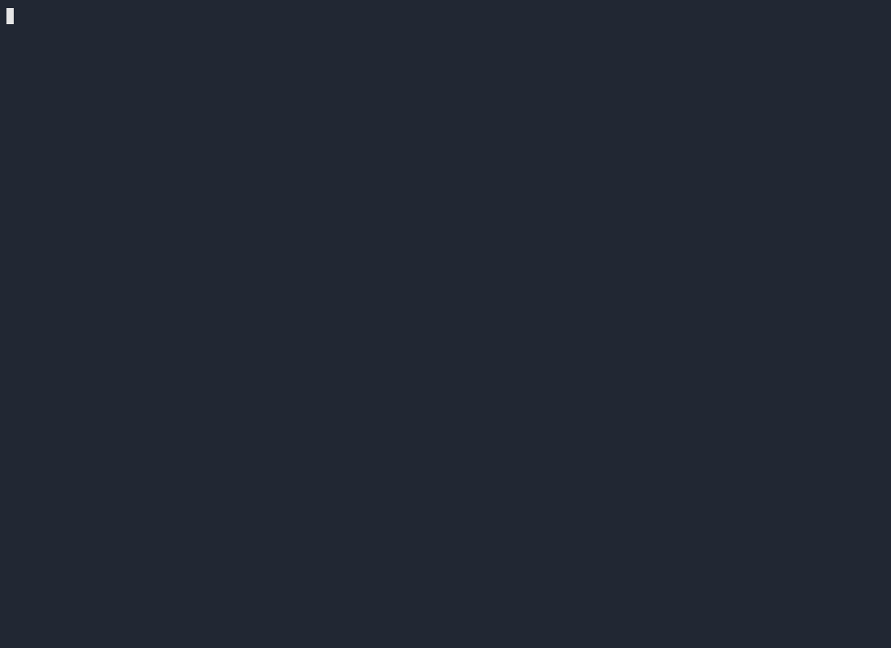

# dsh-tui-pi

pi-style terminal UI for [DeepSeek Harness](https://github.com/deepseek-ai/deepseek-harness) (dsh) — a plugin suite that turns dsh into a pi-like coding agent experience.

**Compatibility:** dsh `0.1.0-rc.7` and `0.1.0-rc.8`. Slash-command execution
adapts to both `dsh-commands` `execute()` signatures at runtime (rc.8 added an
`images` parameter before `signal`; the TUI detects the arity and calls either
form). Verified under rc.8 by unit tests plus a live tmux e2e smoke; the rc.7
call path is identical to the pre-rc.8 direct invocation.

> 中文说明: [README.zh.md](README.zh.md)

## Screenshot



A live terminal recording of a session — todos, running subagents, think/tool
panels and the powerline footer in action. ([Interactive playback on
asciinema](https://asciinema.org/a/BE212ZO8x1zEZyZn))

### Layout overview

```
┌─────────────────────────────────────────────────────────────────────┐
│  Transcript (scrollable)                                            │
│  ┌─────────────────────────────────────────────────────────────┐    │
│  │  💭 thinking — reasoning in progress                        │    │
│  └─────────────────────────────────────────────────────────────┘    │
│  ⚙ bash  python scripts/demo.py  …  ✔ bash                        │
│  ↳ 生成 2 个 todo, 每个 todo 起一个 10s 的 subagent                 │
│  ↳ ⠼ Workhorse 10s 任务 · 1.2k token · 19.0s                       │
└─────────────────────────────────────────────────────────────────────┘
┌─ ● Todos (0/8) ────────────────────────────────────────────────────┐
│ ├─ ☑ 调研 dsh-tui-pi 斜杠命令/补全机制                                │
│ ├─ ◐ 调研 harness ctx.skills API                                   │
│ └─ ☐ 实现 /skill:<name> 补全并触发 skill                             │
└─────────────────────────────────────────────────────────────────────┘
∴ working…                                                            │
~/github (Full access) │ ⎇ main                                       │
[ 请输入指令…                                                       ] │
 ↳ 第一 打slash 命令的时候 显示 /skill:<skill name> 选择后使用          │
  ↳ ⠼ 牛马狗  · 1.5m/1m · 635.7s                                      │
dsh ▸ volc-ark-plan ▸ deepseek-v4-flash ▸ high ▸ 48.7k/1.0M(4.6%)   │
     ▸ ⚡ CH85.4% ▸ 15 msgs ▸ 11 tools                  00:02:13     │
 Esc ×2: stop · Ctrl+C ×2: quit · Ctrl+G: subagents · ↑↓: history   │
└─────────────────────────────────────────────────────────────────────┘
         │                       │                │
         │                       │                └─ Footer (powerline)
         │                       └─ Running subagents (last-request area)
         └─ Todos panel (bordered, above editor)
```

---

## Features

### Footer

A powerline-style status bar pinned at the bottom of the screen, showing live session state at a glance:

```
dsh ▸ volc-ark-plan ▸ deepseek-v4-flash ▸ high ▸ 48.7k/1.0M(4.6%) ▸ ⚡ CH85.4% ▸ 15 msgs ▸ 11 tools     00:02:13
```

Seven segments read O(1) maintained counters (never re-scan the session log):

| Segment | Content |
|---|---|
| **Provider** | current `provider/model` route |
| **Model** | model short-name |
| **Thinking** | reasoning effort level (`off` / `high` / `max`) |
| **Context** | `used / max (percent%)` |
| **Cache-hit** | `CHxx%` — prompt-cache hit rate |
| **Messages** | total user + assistant messages |
| **Tools** | total tool invocations |
| **Clock** | live right-aligned HH:MM:SS (tick every second) |

Segments are rendered with [U+E0B0](https://www.nerdfonts.com/cheat-sheet) powerline arrows; the palette is hot-swappable with the current theme.

The editor's top border shows the working directory and git branch:

```
~/github (Full access) │ ⎇ main
```

---

### Think & Tool Blocks

In-flight thinking and tool calls render as fixed **panels pinned above the chat input** (they never appear in the scrollable transcript):

```
┌─ 💭 thinking ──────────────────────────────────────────────┐
│ Actually, I can check list_agents or wait…                 │
└────────────────────────────────────────────────────────────┘
⚙ bash  python scripts/demo.py  …  ✔ bash
```

Key behavior:

- **One panel per type** — a single `ThinkPanel` and a single `ToolPanel` exist for the whole run; each event refreshes the panel in place, so there's no transcript churn.
- **Empty = hidden** — when nothing is active, the panel renders zero rows and disappears.
- **`dsh-tui.panelHeight`** (default `1`): one borderless row (block id + elapsed + last content line, right-truncated); `5`/`7`/`10` renders a boxed panel; `all` prints the full body.
- **Delegation tools** (`use_agent`, `subagent`, `workflow`, `ralph`) never open a tool block — their children appear as running-agent lines (see Subagents).

---

### Subagents

Running subagent activity is shown in the **last-request area below the editor** as compact, one-line-per-child status rows:

```
↳ 创建 2 个 todo, 每个 todo 起一个 10s 的 subagent
  ↳ ⠼ Subagent A 10s 任务 · 1.2k token · 19.0s
  ↳ ⠼ Subagent B 10s 任务 · 562 token · 6.0s
```

Each line shows: spinner + agent **name**, retries (`↻N≤M`), compact **current-context usage** (`X/Y` — the child's latest request's billed input+output plus a CJK estimate of messages after it, over its context window; NOT the cumulative token spend, which only grows), rounds (`round N/M` — the assistant-message count against the cap, `M` only when `maxRounds > 0`), elapsed. No provider shown, no box, no header — just one line per running child.

Both **spawn-driven** and **fork-driven** children are tracked — dsh creates both through `childSessionMeta`, which writes `origin: 'subagent'` + a `delegationDepth` budget together, so header discovery recognises either marker (a budget-without-origin header is admitted as a defensive fallback and labelled `fork <id8>`; current dsh does not produce that shape). Non-children stay off the board by **value**, not by field presence: the jsonl persistence backend materialises `delegationDepth: 0` on every restored header, so the gate requires a budget `> 0`. User-facing session forks (a forked *conversation*: `Session.fork` sets `parentSession` + `seedLength`, no budget) are deliberately kept off the subagent board and stay resumable via `/resume` — whose filter (`isResumableSessionHeader`) excludes exactly the delegated children (`origin: 'subagent'` or budget > 0).

#### Todos

The `● Todos (done/total)` tree is a bordered panel pinned **above the chat input** (never scrolls with the transcript):

```
┌─ ● Todos (0/8) ──────────────────────────────────────────┐
│ ├─ ☑ Todo 1: research subagent spawn API                 │
│ ├─ ◐ Todo 2: implement /skill:<name> autocomplete        │
│ └─ ☐ Todo 3: add settings panel skills branch            │
└───────────────────────────────────────────────────────────┘
```

Icons: `☑` completed, `◐` in-progress, `☐` pending. A settled child drops off; when empty, both the todo panel and agent lines collapse to zero rows.

#### Viewer & limits

`Ctrl+G` (or `/subagents`) opens an 80% picker over tracked children — running ones first, then the five most recently settled. Enter opens a live transcript viewer (refreshes ~3×/s with tail-follow).

**Steering**: inside the transcript viewer, `Enter` opens a multi-line steer input (`Enter` send · `Shift+Enter` newline · `Esc` cancel). The message is delivered as a plugin-sourced user message, routed by the child's live state: a running child gets it injected at its next step boundary (`steer`), an idle-but-unfinished child gets it queued as its own follow-up turn; a child that has already ended never opens the box — the viewer explains "This subagent has ended — steering unavailable" instead. A failed send keeps the draft with an inline error so it can be retried; a successful one returns to the transcript with a short notice. These viewer keys are hardcoded and not remappable via keybindings.json.

Two caps (`/agents` → `l` to configure):

- **`maxAgents`** (default 4, `0` = unlimited) — spawns are denied when the cap is hit.
- **`maxRounds`** (default 75, `0` = unlimited) — after a child's assistant messages (one per LLM round-trip — the "rounds") reach the cap, the TUI queues one wrap-up request and never force-stops.

---

### DCP (Dynamic Context Pruning)

[DCP](https://github.com/fan56/dsh-dcp) is a standalone zero-LLM compaction plugin for dsh — it automatically trims context to stay within limits without calling an LLM to summarize.

`dsh-tui-pi` lists `@aiwayds/dsh-dcp` as a dependency, but **does not mount it** — dsh-dcp ships its own `cordis.patch.yml` (since `@aiwayds/dsh-dcp@0.2.0`). To activate:

```sh
dsh plugin --profile tui add @aiwayds/dsh-dcp
```

Once mounted, DCP runs transparently in the background. The footer's **context** segment prices the current occupancy — the latest request's billed context plus a CJK estimate of messages after it — so after a compaction the next request lands smaller and the display follows it down (the percent is capped at 100, the window being a hard ceiling). The **cache-hit** segment reflects the session's cumulative cache reuse.

Inside a subagent, a committed compaction is visible too: DCP appends one `user/message` **notice** row per compaction on the child's own log, and the Ctrl+G transcript renders it with a `🧹` marker (distinct from the generic `ⓘ`), with the picker rows carrying the per-child compaction count (`🧹 N×` in the description). Both DCP's `roundInterval` and the TUI's `maxRounds` count the **same** thing — `assistant/message` events, one per LLM round-trip — but act differently: the TUI queues one wrap-up request once a child's count reaches `maxRounds`, while DCP compacts (prunes context) at the next idle boundary once a session's count reaches `roundInterval`. One triggers work, the other frees context.

---

### APPEND_SYSTEM.md

A user-editable markdown file whose content is appended to the **system prompt of the main agent this TUI creates** — borrows pi's `~/.pi/agent/APPEND_SYSTEM.md` convention, dsh side: `$DSH_HOME/APPEND_SYSTEM.md` (default `~/.dsh/APPEND_SYSTEM.md`, honors the same `$DSH_HOME` override as the rest of dsh).

- **Hot-applied** — the section provider reads the file at every prompt assembly, so editing the file picks up on the **next request**: no restart, no watcher, no `/reload`.
- **Auto-seeded on first run** — when the file is missing, the TUI seeds it once at startup from the shipped template `templates/APPEND_SYSTEM.md` (the English orchestrator-identity template: identity, core rules, execution workflow). An existing file is yours — the TUI never overwrites user content.
- **TUI-owned section** — a marked block (`<!-- dsh-tui-pi:todo-lifecycle -->`) is appended once and then maintained idempotently so the model clears its `todo/write` list when every item is done. A marked file is left byte-identical on later startups.
- **Legacy migration** — the same todo block used to be delivered through `~/.dsh/AGENTS.md`. On startup the TUI strips that block once (no-op when absent), so the guidance is never duplicated.
- **Empty / unreadable = no section** — if the file is missing or can't be read, the section is silently dropped. No error, no TUI startup failure.

#### Scope: main agent only

The section is registered on the main agent's **scoped** agent context (`installAppendSystem` in `src/session.ts`) — it lands in that agent's own prompt-scope layer, which subagent scopes never merge. An orchestrator identity ("dispatch sub-agents, never execute yourself") riding on the children would defeat its own purpose, so children see nothing from this file. The mechanism is the same one `dsh-subagent-registry` uses for per-child personas.

#### Example

```sh
# Auto-seeded on first run from templates/APPEND_SYSTEM.md — open and edit.
$EDITOR ~/.dsh/APPEND_SYSTEM.md

# Or replace with your own from scratch (the TUI still keeps its marked
# todo-lifecycle section — it gets re-appended when missing).
cat > ~/.dsh/APPEND_SYSTEM.md <<'EOF'
# Project ground rules

- Always run `pnpm test` before claiming a task is done.
- Prefer dispatching `workhorse` for multi-step investigations.
EOF
```

There's no slash command to toggle the feature — it's always on, controlled by the file's contents.

---

### Ask User Question

While the model is mid-turn it can pause and ask you structured questions via the `ask_user_question` tool (`@deepseek-ai/dsh-tool-ask-user`, mounted by this profile's bundle patch). The TUI hosts the answering side: a framed overlay opens in place, the tool call stays pending until you answer, and your answers flow back to the model as a normal tool result.

- **One overlay, all questions flattened** — every question renders as a header row followed by its supporting `detail` text (when the model supplies any), option rows, plus a `Type something.` sentinel row for free text. Single-select replaces on Enter; multi-select toggles (`[+]` marks).
- **Single-question fast path** — a lone single-select question submits immediately on Enter: picking an option or committing typed free text both submit right away (a question without options is answered by typing alone). A lone multiSelect question instead gets a `⏎ Confirm answers` row so you can pick several options before submitting.
- **Multi-question review page** — with ≥ 2 questions a `⏎ Confirm answers` row hops to a review listing every answer, each row editable in place; `Submit answers` commits (Enter on it while an answer is missing flashes a hint instead of failing silently). After committing free text on one question the cursor hops to the next unanswered one.
- **Double-Esc declines** — two Esc presses within 200 ms return a declined envelope (the model reads it as a normal reply that no answer was given); holding Esc does not accidentally fire (key auto-repeat below a minimum gap is ignored), and closing the overlay through any other path — theme swap, `/reload`, or the tool call being aborted — settles as declined too.
- **Conservative-use guidance** — a system-prompt section nudges the model to ask only when it genuinely needs you (1–3 questions, 2–4 options each), so the TUI doesn't turn into a questionnaire.
- **Keyboard** — `↑↓` navigate · `Enter` select/toggle/confirm · type into the sentinel for free text · `Esc` twice to decline.

Inspired by [juicesharp/rpiv-ask-user-question](https://github.com/juicesharp/rpiv-ask-user-question).

---

## Slash commands

| Command | What it does |
|---|---|
| `/model` | Two-stage provider/model picker (then thinking level). Live switch, persisted; in-panel keys: `f` favorite · `h` hide · `/` filter (favorites/hidden persisted via settings). |
| `/think` | Reasoning-effort picker for the current model (`Off`/`High`/`Max`). |
| `/session` | Read-only info panel: id, cwd, model, token usage, event count. |
| `/resume` | Pick a persisted session, validate its log, then restore it. |
| `/new` | Detach the current session; the next prompt opens a fresh one. |
| `/settings` | Text-based settings browser (namespaces, schema walk, inline editors, secrets masked). |
| `/export` | Write the current session log as JSONL (`~/Downloads/dsh-session-<id>.jsonl`). |
| `/permission` | Permission-preset picker (read-only / workspace-write / danger-full-access). |
| `/theme` | Color-scheme picker (`auto` / `light` / `dark`). Applies immediately. |
| `/preset` | Agent-preset picker; `<name>` switches directly, `next` cycles forward (same as `Tab`). |
| `/agents` | Manage agent markdown files + subagent limits (`maxAgents`, `maxRounds`). |
| `/subagents` | Pick a running/recent subagent and watch its live transcript; `Enter` inside the viewer steers the child (see Subagents). |
| `/reload` | Hot-reload the plugin from source (after `pnpm build`) without restarting dsh. |
| `/hotkeys` | Keybinding browser and live editor. |

Anything that is not a resolvable command falls through to the model as an ordinary prompt.

---

## Keyboard shortcuts

| Key | Action |
|---|---|
| `Enter` | Send the prompt |
| `Esc` | **Double-press to stop** — single press arms (500ms window); popup open → closes popup instead; idle (no task running) → no-op |
| `Ctrl+C` | Mid-turn: first press cancels turn, second quits. Idle: clears editor / quits. **Held-key auto-repeat never quits.** |
| `Ctrl+D` | Quit (only when editor is empty) |
| `Ctrl+L` | Open model/think picker |
| `Ctrl+G` | Open subagent picker (while children are running); inside the transcript viewer, `Enter` opens the steer input (viewer keys hardcoded) |
| `Tab` | Cycle agent presets (footer brand shows the current one as `dsh(<name>)`) |
| `↑` / `↓` | Browse submitted-message history (shell-style, 500 entries) |

### Custom keybindings

Remap any app key through `~/.dsh/keybindings.json` — a partial JSON map of app keys to key ids (`ctrl+letter`, `alt+letter`, named keys). Edit by hand or use `/hotkeys` to change interactively (live-applied, no restart).

---

## Agent presets

The TUI starts with the `standard` agent preset selected when the deployment supplies one; otherwise the first-scanned entry is selected. This is a local selection only: before you interact with `/preset` or press `Tab`, no `meta.agentPreset` is sent at session create, so the server-side default (`agent-presets.default`) governs. The footer brand segment reflects the local selection (`dsh(<name>)`); a switch applies to the next blank session.

---

## Themes

GitHub light / GitHub dark palettes, hot-switchable at runtime:

- `/theme` — live picker; the whole screen repaints including background.
- `DSH_TUI_THEME=light|dark` — env pin that wins over preference.
- `DSH_TUI_TRANSPARENT=1` — see-through canvas (terminal background shows through).
- `auto` mode detects the terminal and follows live light/dark switches.

The full-screen canvas background ships inside the package — a write-stream
decorator (`src/canvas-terminal.ts`) paints every erase sequence with the
theme color via BCE, no patched dependencies.

---

## Fonts

The TUI's only Private-Use-Area glyph is the powerline segment separator
(U+E0B0) in the footer — no default terminal font ships it, so a terminal
without a Nerd/Powerline font shows a tofu box. The `dsh-tui.iconSet`
setting (`auto` | `nerdfont` | `plain`, default `auto`) adapts the risky
glyphs (U+E0B0, ⏹, ⭘) to the terminal:

- `auto` — powerline glyphs when a Nerd/Powerline font is detected at
  startup, safe Unicode stand-ins (`▸ ■ ●`) otherwise.
- `nerdfont` — always the powerline glyphs (you already set the font).
- `plain` — always the safe stand-ins, no font required.

**Install the bundled font in one shot** (install + point the terminal at
it, preserving your font size):

```sh
node scripts/install-font.mjs
```

It copies `assets/fonts/dsh-tui-pi-nerd.ttf` (a ~170KB subset: ASCII +
U+E0B0 + every symbol the TUI renders) into the user font directory and
best-effort flips the terminal: macOS iTerm2 (PlistBuddy, default bookmark),
Linux GNOME Terminal (`gsettings`) and kitty/alacritty/wezterm (config
file, backed up first). Terminal.app is intentionally skipped (its font is
a binary blob) — set it by hand. Every step is wrapped: a failure logs a
warning and moves on, never touching your config destructively.

**Or set the font by hand** — any Nerd Font family as the terminal's main
font (e.g. JetBrainsMono Nerd Font, Hack Nerd Font, or the bundled `DSH TUI
Nerd` after installing it): iTerm2 → Settings → Profiles → Text → Font;
Terminal.app → Settings → Profiles → Text; kitty → `font_family`; alacritty
→ `[font] family`; wezterm → `wezterm.font("…")`. Then `auto` resolves to
the powerline glyphs on the next start.

---

## Install (local)

The `tui` profile installs this plugin from the npm registry — its
`package.json` pins `"@aiwayds/dsh-tui-pi": "<version>"`, resolved by pnpm
like any other dependency. After a release, upgrade the profile with:

```sh
node scripts/dev-upgrade.mjs                  # latest
node scripts/dev-upgrade.mjs 0.15.1 --dry-run # preview the plan first
```

The script verifies the version exists on the registry, updates ONLY the
`"@aiwayds/dsh-tui-pi"` key in `~/.dsh/profiles/tui/package.json`
(formatting-preserving read-modify-write), runs `pnpm install` there, then
checks the installed copy reports the target version. It never touches
`~/.dsh/settings.yaml` or `.credentials.yaml`. Restart dsh (or `/reload`
inside the TUI) to load the new copy.

## Install (npm)

Install the full dsh plugin suite into a fresh profile:

```sh
dsh plugin --profile tui add @aiwayds/dsh-tui-pi
dsh plugin --profile tui add @aiwayds/dsh-subagent-registry
dsh plugin --profile tui add @aiwayds/dsh-dcp
```

Then launch:

```sh
dsh --profile tui
```

**What happens automatically:**

- dsh registers all three plugins in `dsh.profile.bundles` (via `reconcilePlugins`).
- dsh sets `autoInstallPeers: false` in the profile's `pnpm-workspace.yaml`.
- On first boot, dsh calls `healProfilesModuleFallback` to create symlinks
  under `~/.dsh/profiles/node_modules/@deepseek-ai/*` → the global dsh
  closure (`$(which dsh)/../../node_modules/@deepseek-ai`). This gives all
  plugins a single `@deepseek-ai/cordis` instance — no manual closure setup
  is needed.
- `compaction-basic` is disabled by `@aiwayds/dsh-dcp`'s patch; dsh-dcp
  takes over as the compaction backend.

**What does NOT happen automatically:**

- Nothing patch-related anymore: since 0.8.0 the repo and the npm package
  run the same pristine `@earendil-works/pi-tui` — the canvas background is
  painted by our own write-stream decorator (BCE), which ships in the
  package and needs no `pnpm-workspace.yaml` entries in consumer profiles.

### Troubleshooting

| Symptom | Cause | Fix |
|---|---|---|
| `Cannot find package '<name>' imported from ~/.dsh/profiles/...` | A bundle's `cordis.patch.yml` `name` field doesn't match the scoped package name. | Update the plugin; all `@aiwayds/*` plugins now use `name: '@aiwayds/<pkg>'` in their patch. |
| `Cannot find package '@deepseek-ai/dsh-client-schema-form'` on npm-installed dsh | The npm-distributed dsh closure is missing that package (upstream packaging gap — [deepseek-harness discussion #3471](https://github.com/deepseek-ai/deepseek-harness/discussions/3471)). | Fixed for this plugin since 0.8.1 (helpers vendored, no import of the missing package). Other plugins needing it: `cd ~/.dsh/profiles/<profile> && pnpm add @deepseek-ai/dsh-client-schema-form@next`. |
| `Cannot read properties of undefined (reading 'prepare')` | Duplicate `@deepseek-ai/cordis` module instances (two physical copies in the profile tree). | See iron rule 8 in AGENTS.md. Delete physical `~/.dsh/profiles/tui/node_modules/@deepseek-ai` copies and let dsh heal the fallback: `rm -rf ~/.dsh/profiles/tui/node_modules/@deepseek-ai && dsh --profile tui` (the heal recreates them as symlinks). |
| pnpm `Peer dependencies that should be installed: @deepseek-ai/...` warning | A plugin declares `@deepseek-ai/*` as regular `dependencies` instead of `peerDependencies`. | Update the plugin (all `@aiwayds/*` dsh plugins use optional peerDeps). The warning is harmless — pnpm doesn't auto-install optional peers. |
| pnpm `Ignored build scripts: @aiwayds/dsh-tui-pi@...` warning | pnpm 10 blocks build scripts by default; the tui-pi postinstall (`link-dsh-closure.mjs`) was skipped. | This is expected and **harmless** — the postinstall only matters for the repo dev flow, not npm consumers. dsh handles closure linking via `healProfilesModuleFallback`. |

---

## Use

```sh
dsh --profile tui        # or: dsh-tui-pi (bin shim)
```

---

## Dev

```sh
pnpm check    # tsc --noEmit
pnpm build    # emit lib/
pnpm test     # unit tests, node --test against lib/ (654 tests, pretest builds)
```

Local type-checking symlinks `node_modules/@deepseek-ai/*` to the installed
dsh closure (`/opt/homebrew/lib/node_modules/@deepseek-ai/dsh/node_modules`);
those symlinks stay out of any tarball. `scripts/link-dsh-closure.mjs` (the
package's `postinstall`) re-creates every link after each `pnpm install`.

**pi-tui**: pristine `@earendil-works/pi-tui` 0.84.2 from npm — no patches,
no fork. The full-screen canvas background is our own write-stream decorator
(`src/canvas-terminal.ts`, BCE).

---

## Layout

```
bin/dsh-tui-pi        launcher shim (exec dsh --profile tui)
cordis.patch.yml      bundle patch: mounts the plugin as `tui-pi`
src/
  index.ts            cordis plugin entry: command registration, footer,
                      git watcher, clock, bridge, theme hot-swap, shutdown
  tui.ts              alt-screen tree, transcript ScrollView, dock, canvas bg
  session.ts          DshSessionBridge: agent create, followup, resume,
                      O(1) incremental stats, subagent tracker
  live-widgets.ts     Todos panel + running-agent activity lines
  messages.ts         TranscriptRenderer: session events → pi-tui components,
                      streaming setText, height-configurable panels
  footer.ts           PowerlineFooter (7 segments + clock)
  editor.ts           CwdBorderEditor (top border: cwd + git branch)
  subagent-policy.ts  maxAgents guard + maxRounds wrap-up injection
  subagent-viewer.ts  Ctrl+G picker + live transcript panel + Enter steer injection
  ask-user.ts         Ask User Question overlay: pure state reducers +
                      framed overlay UI + ctx.userQuestions provider
  theme/              GitHub light/dark palettes + terminal detection
test/*.test.mjs       unit tests (654 across 40 files)
```

---

## Changelog

See [CHANGELOG.md](CHANGELOG.md) for the release history.

---

## Credits

- [Ask User Question](#ask-user-question) is inspired by
  [juicesharp/rpiv-ask-user-question](https://github.com/juicesharp/rpiv-ask-user-question) —
  the interaction design (flattened option list with a free-text sentinel,
  multi-question review page, decline gesture) was adapted to this TUI's
  framed-overlay and dsh `userQuestions` provider architecture. All code here
  is original.
